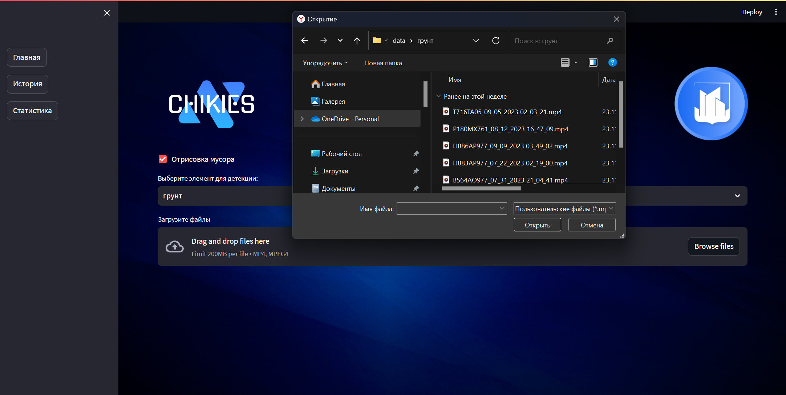
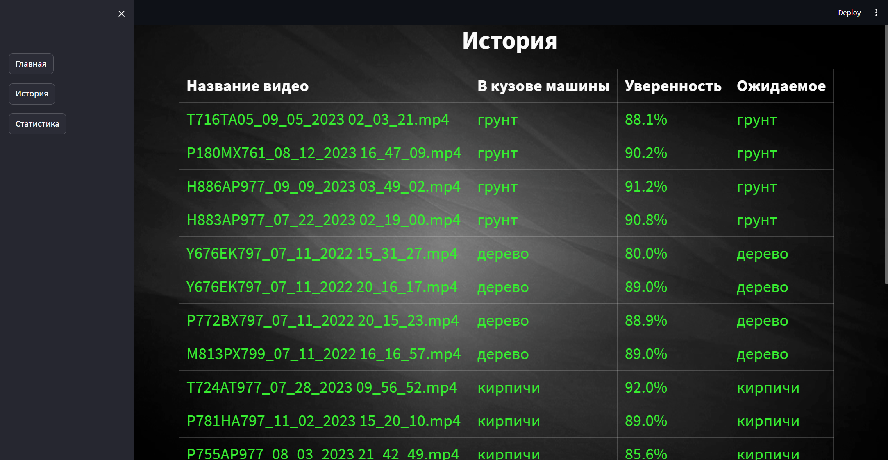

# Кейс: Определение вида отходов строительства в кузове транспортного средства

> Разработай сервис для классификации строительных отходов в кузове грузовика

## Команда: Chikies


<!-- **Проблематика:**

- 1
- 2
- 3
- 4 -->

**Мы предлагаем:**

- MVP продукт в виде веб-сервиса
- Практически идеальное решение для классификации груза
- История загруженных видео с ожидаемой и реальной меткой
- Функционал для аналитики в виде диаграммы

**Основной функционал:**

- Загрузка видео для обработки
- Определение метки и ее отрисовка на кадре
- Возможность проверить, ожидаемый ли вид груза на деле лежит в кузове
- Возможность увидеть процент ошибок и провести анализ благодаря диаграмме.

**Краткое описание**: 

Мы представляем модель для автоматического определения вида строительного отхода, находящегося в кузове. Наш веб-сервис является идеальным способом получения информации о виде отхода. Класс строительного отхода определяется с высокой точностью, так как мы тестировали несколько моделей искусственного интеллекта. Точность нашей основной модели выше 98%, что является практически идеальным вариантом. 

<!--  -->



Также клиенту предоставляется возможность выбрать ожидаемую метку того, что должно лежать в кузове грузовика, чтобы в будущем просто сравнить ожидаемую и реальную метку благодаря вкладке "История", где сохраняются данные о всех загруженных видео.




Также мы предлагаем пользователю проводить аналитику с помощью нашего сервиса, так как мы создали функционал, позволяющий оценить диаграмму, где показано количество определенных меток в каждом из классов и процент неправильно вывезенного груза.


Стэк: Python, StreamLit, PyTorch, YoloV8


**Для тестирования нашего веб-приложения достаточно склонировать наш репозиторий и скачать веса моделей**

скачать веса вы можете здесь https://disk.yandex.ru/d/w5N1Ps_orF8W7g

в репозитории по умолчанию есть веса тестируемой модели, поэтому скачивать дополнительные веса не обязательно


тестирование:
```
    git clone https://github.com/seyveR/hackChikiesMsc.git
    # скачайте и добавьте веса модели в папку проекта
    streamlit run server.py
```
